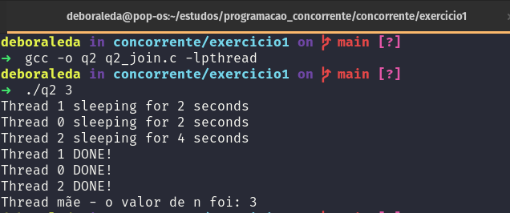
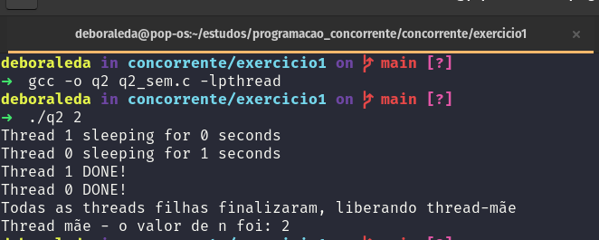

# Como executar

## Questão 2 - versão com join

Compile o código com o seguinte comando:

```shell
gcc -o q2 q2_join.c -lpthread
```

Em seguida, execute passando o valor de `n` como parâmetro:

```shell
./q2 <valor_de_n>
```

Exemplo de execução:



## Questão 2 - versão com semáforo

> OBS: o semáforo é inicializado usando a função `sem_init`, o que pode
gerar incompatibilidade com macOS

Compile o código com o seguinte comando:

```shell
gcc -o q2 q2_sem.c -lpthread
```

Em seguida, execute passando o valor de `n` como parâmetro:

```shell
./q2 <valor_de_n>
```

Exemplo de execução:



## Questão 3

Compile o código com o seguinte comando:

```shell
gcc -o q3 q3.c -lpthread
```

Em seguida, execute passando o valor de `n` como parâmetro:

```shell
./q3 <valor_de_n>
```