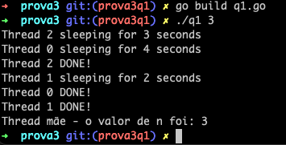
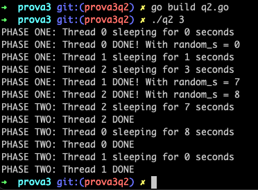

# Como executar

## Questão 1

Compile o código com o seguinte comando:

```shell
go build q1.go
```

Em seguida, execute passando o valor de `n` como parâmetro:

```shell
./q1 3
```

Exemplo de execução:



## Questão 2

Compile o código com o seguinte comando:

```shell
go build q2.go
```

Em seguida, execute passando o valor de `n` como parâmetro:

```shell
./q2 3
```

Exemplo de execução:



## Questão 3
